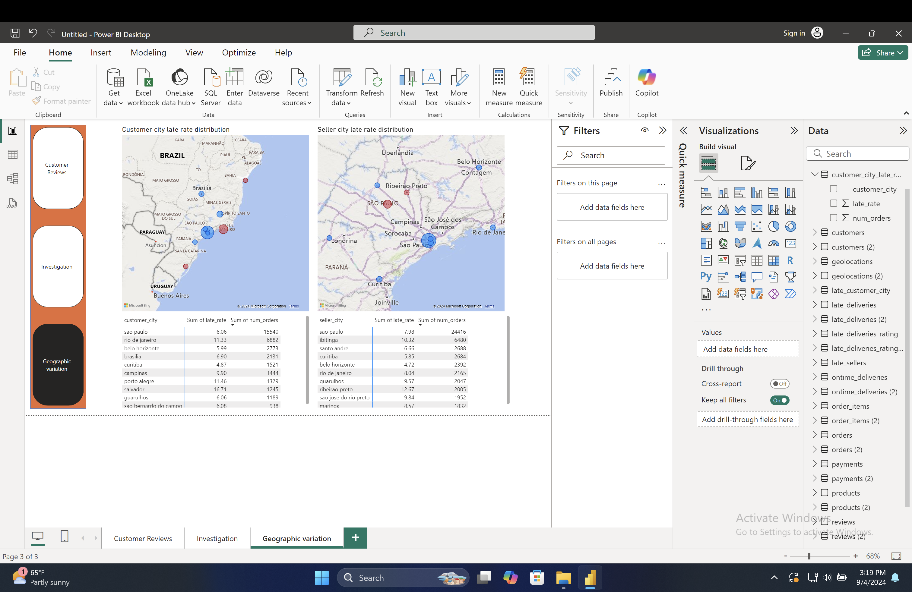

# Brazil Sales Analysis Project




## Overview
This project provides tools and data for analyzing sales patterns in 
Brazil. By leveraging SQLite3 and Power BI, users can gain valuable 
insights into Brazilian market trends and consumer behavior.


## Prerequisites
Before you begin, ensure you have the following installed on your system:

* SQLite3
* Power BI


## Getting Started
1. **Download the Database**
First, download the SQLite database file from the following link:
[Download Brazil Sales Database](link to database)
2. **Clone the Repository**
Clone the analysis scripts and additional resources using the following 
command:
```bash
git clone https://github.com/alkrona/Brazil_sales_analysis
```
3. **Set Up Your Environment**

Place the downloaded database file in the cloned repository folder.
Open SQLite3 and connect to the database.
Launch Power BI and import the data from the SQLite database.


## Project Structure
```markdown
Brazil_sales_analysis/
│
├── data/
│   └── brazil_sales.db
│
├── scripts/
│   ├── data_cleaning.sql
│   └── analysis_queries.sql
│
├── powerbi/
│   └── sales_dashboard.pbix
│
└── README.md
```

## Usage

Use the provided SQL scripts in the `scripts/` directory to clean and 
analyze the data.
Open the Power BI file in the `powerbi/` directory to visualize the 
results.


## Contributing
We welcome contributions! Please see our [Contributing Guidelines](link to 
guidelines) for more details.


## License
This project is licensed under the MIT License - see the LICENSE file for 
details.


## Acknowledgments

* Brazilian E-commerce Public Dataset by Olist
* SQLite team for their excellent database engine
* Microsoft for Power BI


For questions or support, please open an issue in this repository.
Happy analyzing! 🇧🇷📊
